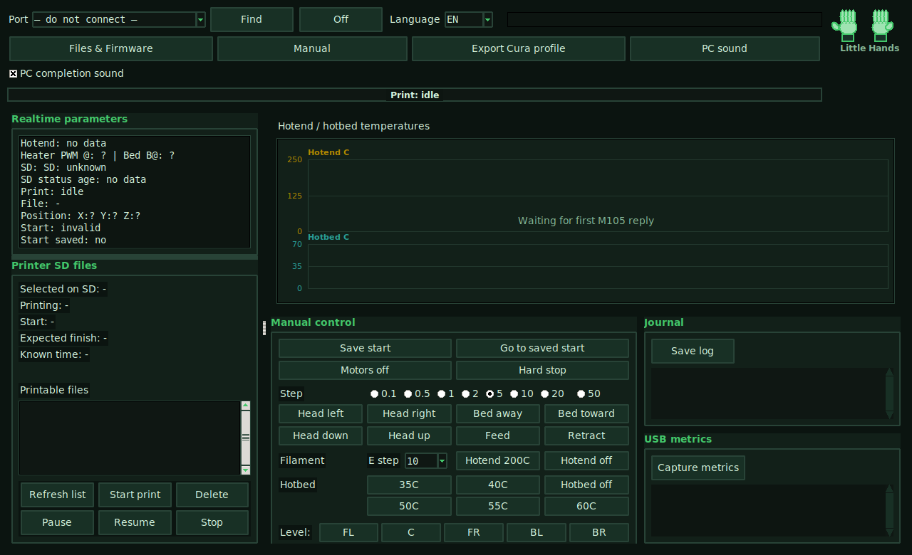

# Little Hands For EasyThreeD K9

Little Hands is a Linux desktop control center for a very specific 3D-printer setup:

- printer: `EasyThreeD K9`
- board family: `ET4000+ / ET4000PLUS`
- current validated firmware: `LH-v4-YZSwap-AutoFan45-FAN1-z600-e1040-mksLite.bin`
- slicer baseline: `Cura 5.11`
- heated bed baseline: external warm mat / hotbed, not electrically wired into the printer mainboard

This project is still a little rough, but it already works for real printing.

- USB/SD control works
- firmware upload works
- manual-zero workflow works
- logging works
- Cura export works
- print progress and temperature monitoring work

What is still rough:

- this is not a generic `K9` package for every board variant
- there is no true endstop-based auto-home yet
- after a failed print start, the safest recovery is still a printer power cycle
- Windows packaging is only planned, not shipped
- the app UI is still primarily Russian even though the docs are now bilingual

## Screenshot



## Language Versions

- English:
  - [README.md](README.md)
  - [Linux setup](docs/INSTALL_LINUX.md)
  - [Printer and firmware guide](docs/PRINTER_AND_FIRMWARE.md)
- Russian:
  - [README.ru.md](README.ru.md)
  - [Установка на Linux / Raspberry Pi](docs/INSTALL_LINUX.ru.md)
  - [Принтер и прошивка](docs/PRINTER_AND_FIRMWARE.ru.md)
- Chinese:
  - [README.zh.md](README.zh.md)
  - [Linux / Raspberry Pi 安装](docs/INSTALL_LINUX.zh.md)
  - [打印机与固件说明](docs/PRINTER_AND_FIRMWARE.zh.md)

## Current Supported Setup

The current public baseline is the protected second `K9`.

- tested printer family: `EasyThreeD K9`
- tested board family: `ET4000+ / ET4000PLUS`
- tested firmware: `LH-v4-YZSwap-AutoFan45-FAN1-z600-e1040-mksLite.bin`
- tested app: `tools/k9_control_center.py`
- tested Cura machine: `lilHands K9 warm mat`
- tested Cura profile: `codex - K9 warm mat cautious`

Do **not** assume this will work unchanged on a random `K9`.
The first experimental printer and the protected second printer already behaved differently during rollout.

If you are onboarding a second machine safely, use:

- [SECOND_K9_INTAKE.md](SECOND_K9_INTAKE.md)
- [SECOND_K9_ROLLOUT.md](SECOND_K9_ROLLOUT.md)

If you are helping a friend bring this up on a Raspberry Pi, use:

- [RASPBERRY_PI_FRIEND_CHECKLIST.md](RASPBERRY_PI_FRIEND_CHECKLIST.md)

## How Home Works

This setup does **not** use a normal endstop-based Marlin `G28` workflow.

Instead, Little Hands uses a manual-zero workflow:

1. Move the printer into a known print start pose.
2. Press `Запомнить старт`.
3. The app tells the printer `G92 X0 Y0 Z0`.
4. `К старту` returns to that logical zero during the current clean session.

This means:

- this is a practical operator workflow, not a true sensor-based home
- after a failed print start, the safest next step is usually:
  - power cycle the printer
  - re-check the start pose
  - press `Запомнить старт` again

## External Warm Bed / Hotbed Note

The validated second printer uses an external warm mat / hotbed.

- it is heated by its own external power path
- it is **not** controlled by the printer firmware
- the printer should still see `bed temp = 0`
- the validated working range was around `40-50C`

Important:

- do not put a random stock plastic sheet directly onto a raw external heater
- use a heat-safe build surface
- the validated setup used the perforated flexible print surface on the warmed bed

## Quick Start

1. Install Linux dependencies:
   - [docs/INSTALL_LINUX.md](docs/INSTALL_LINUX.md)
2. Read the printer/firmware guide:
   - [docs/PRINTER_AND_FIRMWARE.md](docs/PRINTER_AND_FIRMWARE.md)
3. Start the app:

```bash
python3 tools/k9_control_center.py
```

4. In Cura choose:
   - machine: `lilHands K9 warm mat`
   - profile: `codex - K9 warm mat cautious`

## Recommended Firmware File

Use this file for the current public baseline:

- [`firmware/LH-v4-YZSwap-AutoFan45-FAN1-z600-e1040-mksLite.bin`](firmware/LH-v4-YZSwap-AutoFan45-FAN1-z600-e1040-mksLite.bin)

Archive and historical firmware files are kept in `firmware/`, but they are not the recommended default for new users.

## Repository Layout

- `tools/`
  - the Little Hands GUI and USB/SD helper code
- `firmware/`
  - current recommended firmware and historical builds
- `docs/`
  - install and printer guides
- `SECOND_K9_INTAKE.md`
  - safe intake checklist for a protected second printer
- `SECOND_K9_ROLLOUT.md`
  - careful rollout procedure for the validated second K9 baseline
- `RASPBERRY_PI_FRIEND_CHECKLIST.md`
  - bring-up checklist for a friend on Raspberry Pi
- `PROJECT_LOG.md`
  - detailed working log and engineering history

## Status

This repo is not pretending to be fully polished yet.

It is best described as:

- actively used
- field-tested on a real K9
- still evolving
- good enough to print
