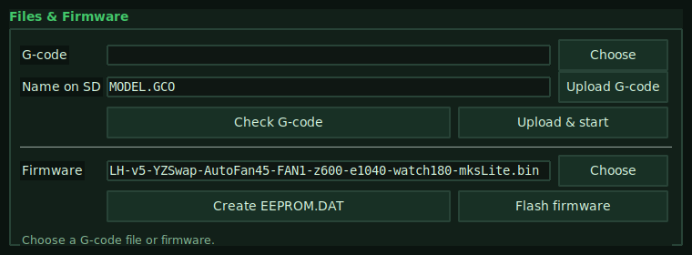
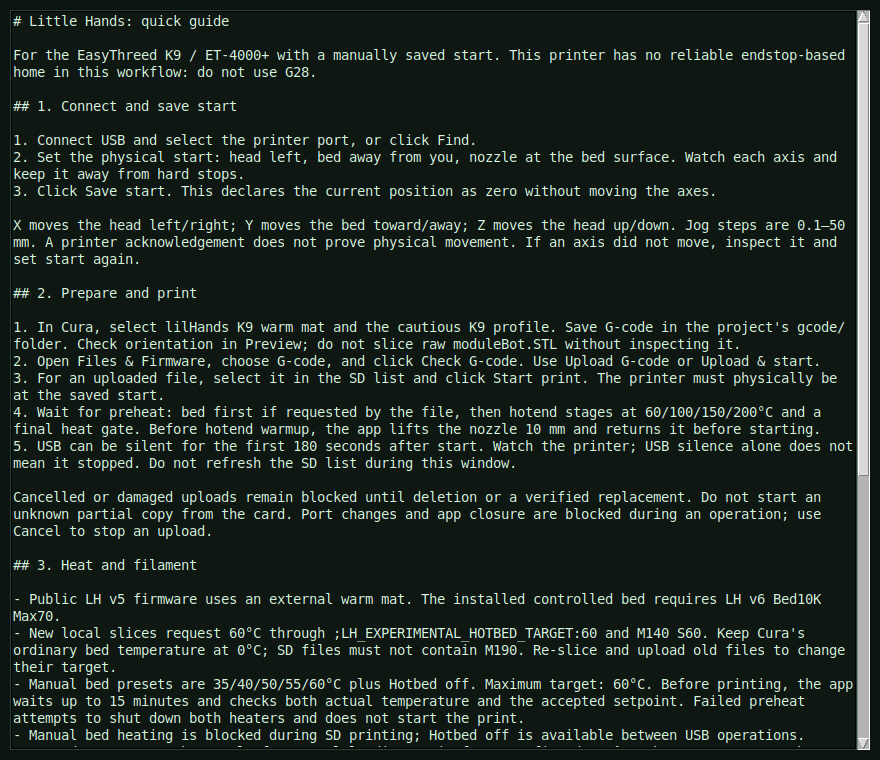

# 打印机与固件说明

## 1. 当前支持的硬件基线

当前仓库的公开说明面向：

- 打印机型号：`EasyThreeD K9`
- 主板家族：`ET4000+ / ET4000PLUS`
- 已验证的公开基线：`EasyThreeD K9` + `ET4000+ / ET4000PLUS`

重要说明：

- 这并不意味着所有 `K9` 都完全相同
- 在开发过程中，不同 `K9` 已经表现出不同的行为
- 当前最安全的公开基线使用 `LH v4`

## 2. 当前推荐固件

请使用：

- `firmware/LH-v4-YZSwap-AutoFan45-FAN1-z600-e1040-mksLite.bin`

选择它的原因：

- 固件会在 `M115` 中给出明确的 `LH` 身份
- 已验证与 `Little Hands` 兼容
- `FAN1` 在 `45C` 自动启停
- 使用接近 stock 的运动参数：
  - `X606`
  - `Y606`
  - `Z600`
  - `E1040`
- 已验证的操作者视角运动定义：
  - `X` = 喷头左右
  - `Y` = 喷头上下
  - `Z` = 平台前后

## 3. 固件识别

刷写成功后，应用应能识别出类似：

- `LH v4 YZSwap AutoFan45 FAN1 Z600 E1040`

## 4. 安全刷写流程

### 方式 A：通过 Little Hands

1. 打开 `Files & Firmware`
2. 选择：
   - `firmware/LH-v4-YZSwap-AutoFan45-FAN1-z600-e1040-mksLite.bin`
3. 上传固件到打印机 SD
4. 等待打印机完成刷写 / 重启
5. 之后从卡上删除 `mksLite.bin` 或 `mksLite.CUR`
6. 保留 `EEPROM.DAT`



### 方式 B：通过读卡器

1. 把 SD 卡插入读卡器
2. 将固件复制为：
   - `mksLite.bin`
3. 把卡插回打印机
4. 通电 `30–60` 秒
5. 断电
6. 取出卡
7. 删除 `mksLite.bin` 或 `mksLite.CUR`
8. 保留 `EEPROM.DAT`
9. 再把卡放回打印机

## 5. EEPROM.DAT

`EEPROM.DAT` 很重要。

它保存打印机设置，例如：

- 运动参数
- 限制
- 偏移
- 已保存的固件设置

规则：

- 不要反复删除它
- 固件初始化后应保留在卡上
- 新刷写后应确认设置已初始化并且文件存在

## 6. Home 的工作方式

目前项目使用 `manual-zero`，不是真正的限位自动回零。

也就是说：

1. 操作者把打印机移动到已知的物理起始姿态
2. `Save start` 用下面的命令把它设为逻辑零点：

```gcode
G92 X0 Y0 Z0
```

3. `Go to start` 会在干净、可信的会话中回到这个逻辑零点

因此：

- 这是一种实用并且已经经过现场验证的工作流
- 但它还不是在任意外部移动后的绝对 home
- 如果启动失败或状态可疑，应重新建立起始姿态并重新设零



## 7. 外部 warm bed / hotbed

已验证的公开基线使用外部 heated bed / warm mat。

重要事实：

- 由外部加热
- 不作为“受控热床”接入打印机主板
- 固件应仍表现为“无热床控制”的打印机
- 在已验证的 Cura 基线中，热床温度保持为 `0`

已验证的实际组合：

- 外部热床约 `40–50C`
- 热床上覆盖打孔柔性打印面

## 8. Cura 基线

对于当前已验证的公开基线：

- machine: `lilHands K9 warm mat`
- profile: `codex - K9 warm mat cautious`

当前 end-gcode 规则：

- 使用 raw Marlin `G1 Y95` 展示完成的模型；在验证过的机器上它会把平台推向操作者
- 不要在 Cura end-gcode 里加入 `M84`；`Little Hands` 会在恢复移动和 SD 打印开始前主动启用步进电机
- 如果旧文件以 `G1 Y0` 或 `M84` 结尾，请先重新切片，再判断打印完成动作是否正确

需要重新切片的情况：

- 固件基线改变
- 轴映射改变
- 文件是为另一台机器生成的

## 9. 首次安全打印流程

1. 刷写 `LH v4`
2. 确认 tiny jog 映射正确
3. 确认外部热床已经预热
4. 在已验证的 Cura 机器/配置中切片
5. 上传 G-code
6. 设定物理起始姿态
7. 点击 `Save start`
8. 点击 `Go to start` 并确认它确实返回正确位置
9. 从 SD 启动打印

## 10. 两次打印之间

一次 SD 打印成功结束后，下一次启动前请按这个顺序操作：

1. 从平台上取下模型。
2. 在已保存零点仍然有效时点击 `Go to start`。
3. 关闭打印机电源 `5–10` 秒，然后重新打开。
4. 确认打印机仍在起始位置。
5. 点击 `Save start`。
6. 开始下一次 SD 打印。

打印完成后，应用会阻止重复 SD 启动，直到这个恢复流程被确认。

## 11. 恢复规则

如果打印启动失败并看到：

- 咔哒声
- 没有运动
- 遥测冻结
- 状态过期
- `device reports readiness to read but returned no data`

目前最安全的流程是：

1. 停止打印
2. 重启打印机电源
3. 重新确认起始位置
4. 点击 `Save start`
5. 再次启动
